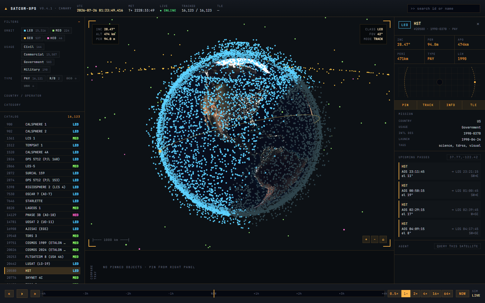
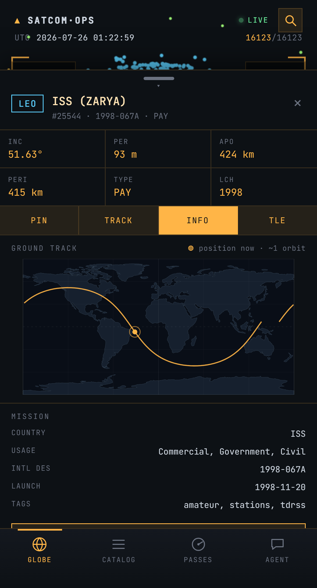

# Satellite Tracker — "Ops Console"

[](https://github.com/OrangeAgente/Satellite-Tracker/actions/workflows/ci.yml)
[](LICENSE)

A mission-control-styled satellite tracker. It renders **~16,000 tracked objects** at their real
current positions on a 3D globe, propagated locally with SGP4, and pairs that with pass
prediction for your location and an LLM assistant grounded in live orbital state.

**Live demo:** <https://sattracker-production.up.railway.app>



## What it does

- **Real orbital mechanics, client-side.** SGP4/SDP4 propagation runs in a Web Worker at 4 Hz
  from live CelesTrak TLEs — not canned positions. Earth shadow (eclipse) is computed per object
  in the shader.
- **Pass prediction.** Enter an observer location and get real AOS/LOS times, max elevation and
  compass headings for the next 24 h. Computed on-device; your coordinates aren't needed by any
  server for this.
- **Time travel.** Scrub ±4 h or run the simulation at up to 64×; the globe, ground tracks and
  terminator all follow.
- **A grounded assistant.** Ask about a selected satellite and the answer is built on real
  computed state — current sub-satellite point, altitude, velocity, sunlit/eclipsed, and your
  upcoming passes — rather than the model's recollection.
- **Responsive.** A purpose-built mobile UI below 768 px, sharing the same store, propagation
  worker and 3D globe as the desktop console.

<p align="center">
  
</p>

## Quick start

```bash
npm install
npm run build:data     # fetch CelesTrak catalog -> public/data/satellites.json (~60s)
npm run dev            # http://localhost:5173
```

The assistant needs a [Cohere](https://cohere.com) key. In production it's read **server-side
only** and never reaches the browser:

```bash
COHERE_API_KEY=... node server/server.js      # serves dist/ + proxies /api/chat
```

In dev (no proxy running) the UI will offer to store a key in your browser instead. That path is
disabled in production builds.

### Docker

```bash
docker compose up --build                      # dev, hot reload → :5173
docker compose --profile prod up --build prod  # production image → :8080
```

## How it fits together

```
scripts/build-dataset.mjs   # CelesTrak GP + SATCAT -> public/data/satellites.json
server/server.js            # static server + /api/chat (Cohere) + /api/tle (cached) — stdlib only
src/propagation/            # SGP4 Web Worker, transferable Float32Array positions
src/globe/                  # three.js: Earth, 16k-point cloud, orbit line, ground track
src/agent/                  # prompt construction + live SGP4 state for the assistant
src/ui/  src/mobile/        # desktop console and mobile shell (shared zustand store)
```

**Why a server at all?** The Cohere key must never ship to the browser, and the deployed CSP is
`connect-src 'self'`, so the browser can't call third-party APIs directly. `server/server.js` is a
dependency-free Node process that serves the built site, proxies chat, and caches CelesTrak TLEs.

## Development

```bash
npm run typecheck   # tsc
npm run lint        # eslint
npm test            # vitest — unit + component
npm run test:e2e    # playwright — mobile + desktop (builds and previews first)
npm run build       # production bundle
```

> **Node 22+ / npm 12+.** The Docker build runs a strict `npm ci`, and npm 10 and 12 resolve this
> lockfile differently — installing with an older npm will regenerate `package-lock.json` and break
> the image build. See `engines` in `package.json`.

## Security notes

This is a public demo, so a few things are deliberate:

- The Cohere key is server-side only; three independent layers keep it out of the browser
  (build-time `PROD` guard, an unreachable dev-only code path, and `connect-src 'self'`).
- `/api/chat` owns its own system prompt. Client-supplied context is fenced as untrusted data, so
  the endpoint can't be repurposed as a general-purpose LLM.
- Third-party catalog text is sanitized and delimited before it reaches the model.
- Per-IP rate limiting, output caps, upstream timeouts, and cancellation on client disconnect.

## Data sources & attribution

- **[CelesTrak](https://celestrak.org)** — GP/TLE orbital elements and the SATCAT catalog
  (object type, country, launch date). Please respect their
  [usage guidelines](https://celestrak.org/publications/) if you fork this; the server caches TLEs
  for an hour rather than polling per client.
- Orbital propagation via **[satellite.js](https://github.com/shashwatak/satellite-js)**.
- Coastlines from **[Natural Earth](https://www.naturalearthdata.com/)** (110m land, public domain).

Positions are derived from public TLEs and are approximate. **Not for operational use.**

## Interactions

- **Drag** to rotate, **scroll/pinch** to zoom, **click** a point to select it.
- **Search** by name or NORAD id. **Filters** intersect (orbit ∩ usage ∩ type ∩ …).
- Colour key: **cyan** LEO · **green** MEO · **amber** GEO · **magenta** HEO. Debris and rocket
  bodies are dimmed; pinned objects turn green.

## License

MIT — see [LICENSE](LICENSE).
